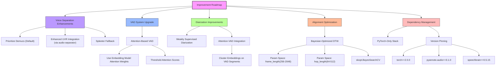

# DeepVoice

A comprehensive Python library for voice analysis, processing, and speaker identification.

## Overview

DeepVoice is a powerful toolkit that combines various state-of-the-art techniques for voice processing, including voice separation, speaker diarization, voice verification, and voice representation. It leverages modern machine learning frameworks to provide robust tools for audio analysis and voice-related tasks.

## Features

- **Voice Extraction**: Isolate individual voices from multi-speaker audio using multiple extraction engines:
  - Spleeter
  - UVR (Ultimate Vocal Remover)
  - Demucs

- **Speaker Identification**: Identify and verify speakers using advanced voice embeddings:
  - X-vector embeddings
  - SpeechNet embeddings
  
- **Voice Verification**: Compare voice samples to determine if they belong to the same speaker

- **Voice Confidence**: Calculate confidence scores for voice similarity using multiple metrics

- **Speaker Diarization**: Segment audio by speaker and identify who speaks when

- **Voice Representation**: Create numerical representations of voice characteristics for further analysis

## Installation

### Requirements

- Python 3.9
- Ubuntu/Debian recommended for full compatibility

### Using pip

```shell script
pip install numpy scipy torch torchaudio pyannote.audio librosa soundfile matplotlib PyAudio
pip install deepvoice
```

### System Dependencies

```shell script
sudo apt-get update
sudo apt-get install -y ffmpeg portaudio19-dev python3-dev
```

## Quick Start

```python
from deepvoice import DeepVoice

# Extract voices from an audio file
voices = DeepVoice.extract_voices("recording.wav")

# Verify if two voice samples belong to the same speaker
is_same_speaker = DeepVoice.verify("voice1.wav", "voice2.wav")

# Get a numerical representation of a voice
voice_embedding = DeepVoice.represent("voice.wav")

# Find a specific voice in an audio recording
matches = DeepVoice.find("target_voice.wav", "recording.wav")
```

## Advanced Usage

### Voice Extraction with Different Backends

```python
# Extract using Spleeter (good for general purpose)
voices = DeepVoice.extract_voices("recording.wav", method="spleeter")

# Extract using UVR (better for music)
voices = DeepVoice.extract_voices("recording.wav", method="uvr")

# Extract using Demucs (high quality but resource intensive)
voices = DeepVoice.extract_voices("recording.wav", method="demucs")
```

### Speaker Diarization

```python
# Get timeline of who speaks when
diarization = DeepVoice._diarize_voices("conversation.wav")

# Output: [(0.0, 1.5, "speaker_1"), (1.5, 3.2, "speaker_2"), ...]
```

### Voice Confidence Calculation

```python
# Calculate confidence that two voice samples belong to the same speaker
confidence = DeepVoice._calculate_voice_confidence("voice1.wav", "voice2.wav")

# Output: 0.87 (indicating 87% confidence they match)
```

## Performance Considerations

- Voice processing can be resource-intensive, especially with larger audio files
- Consider using GPU acceleration for faster processing when available
- Process longer audio files in smaller chunks for optimal performance

## Dependencies

The library relies on several key dependencies:
- NumPy & SciPy for numerical operations
- PyTorch & TensorFlow for deep learning models
- Librosa & SoundFile for audio processing
- Spleeter, Demucs, and UVR for voice separation
- PyAnnote.Audio for diarization
- SpeechBrain for voice embeddings

## TODOs



## License

MIT License

## Contributing

Contributions are welcome! Please feel free to submit a Pull Request.

## Citation

If you use DeepVoice in your research, please cite:

```
@software{deepvoice,
  title = {DeepVoice: A Python Library for Voice Analysis and Processing},
  author = {Yilmaz Mustafa},
  year = {2025},
  url = {https://github.com/codesapienbe/deepvoice}
}
```
## Resources

### Media: 

1. https://youtu.be/37R_R82lfwA: Pyannote, an open-source toolkit written in Python for speaker diarization. Based on PyTorch machine learning framework, it provides a set of trainable end-to-end neural building blocks that can be combined and jointly optimized to build speaker diarization pipelines. pyannote.audio also comes with pre-trained models covering a wide range of domains for voice activity detection, speaker change detection, overlapped speech detection, and speaker embedding.